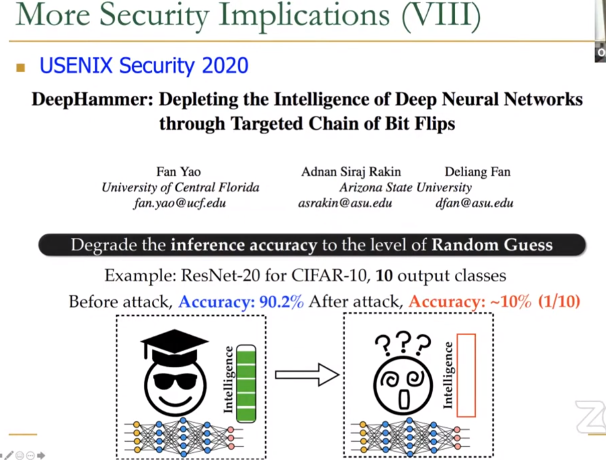
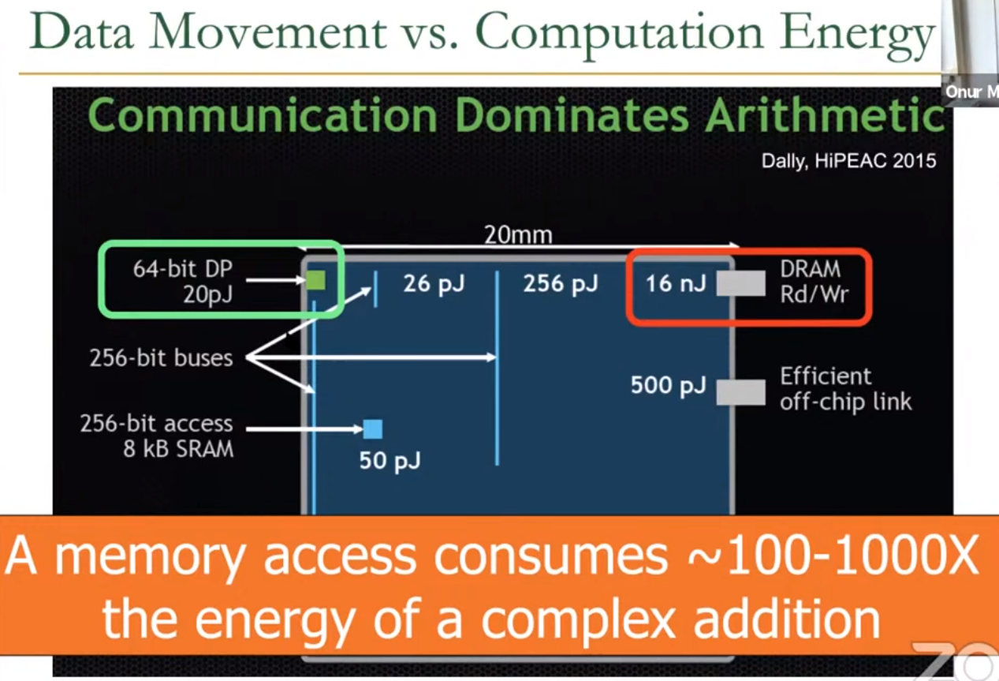

### Interesting Things
- Security
- Safety
- Reliablity

#### Security: DRAM Rowhammer

- Every user can do rowhammer, even through the network.
- rowhammer is much controllable, since no physical touch of hardware is needed.

#### Meltdown and Spectre:
- Speculative execution leaves trace of secret data in the cache, which might be inspected by the malicious software.

#### Data-Centric Applications
- like AI,ML,Genomics.
- All data-intensive.
- Data is Key for future workloads.
- Data movement overwhelms modern machine!

### Landscape of CA

- The system become more and more complex.
- Application are now increasingly demanding.(human are greedy)
- Complex and divergant Tradeoff

Heterogeneous Everywhere in Memory.
System became increasingly complex.

Applications and tech both demand novel architectures.Hence:

- Each component and its interface, as well as the entire system designs are bing re-examined.

- We need to design the entire system to solve problems that at both layers and emerge the layer across.
 

### Being a Architect - Cross the Abstraction Layers

- We should cross the layers to enable more optimization.
