# Introduction

- Different design goals -> Different computing platform.
- new idea -> new design

### Why study CA
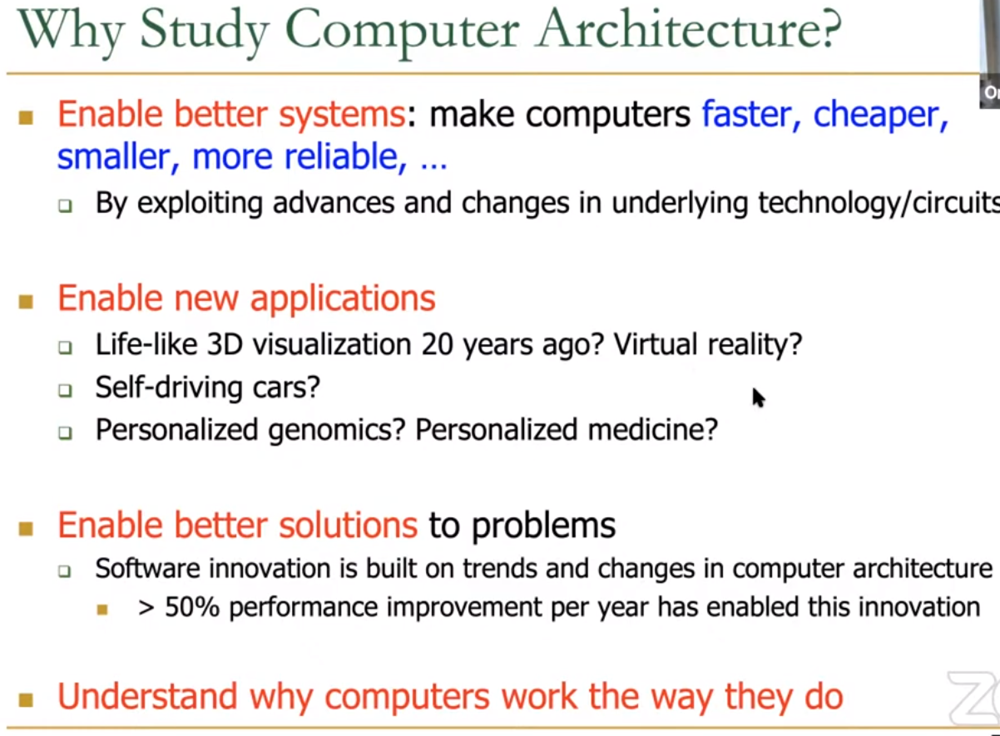

### CA Today
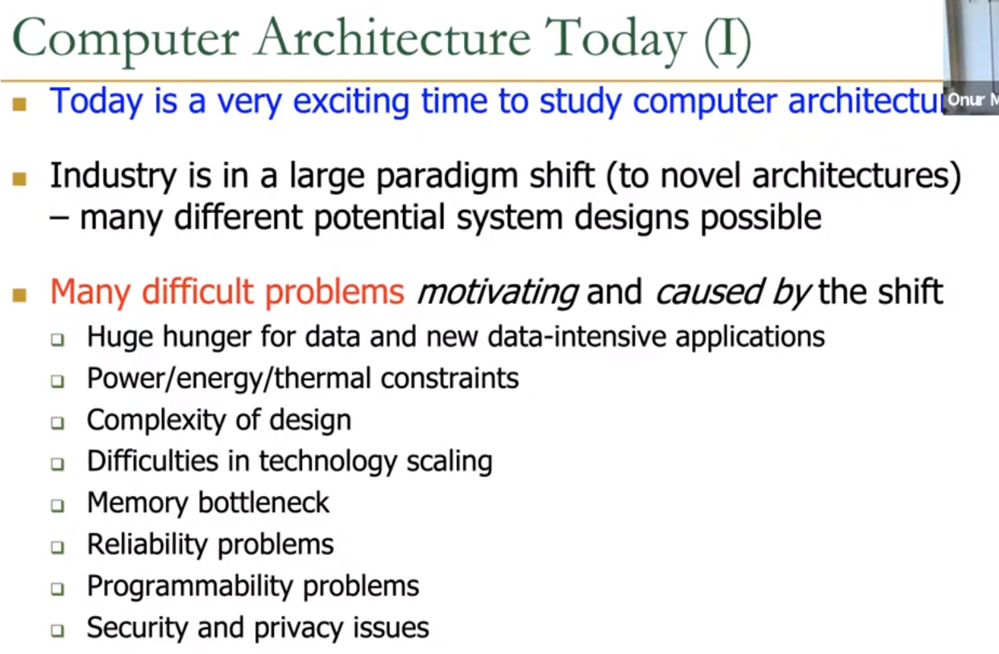

### Computing Stack
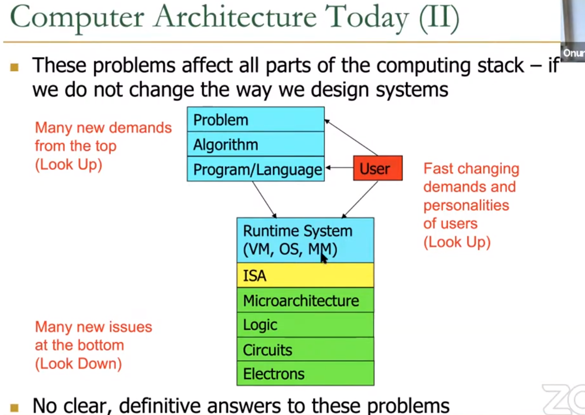

### The CA Today
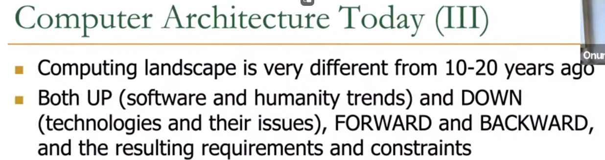 

### Opportunities From Bottom and Top
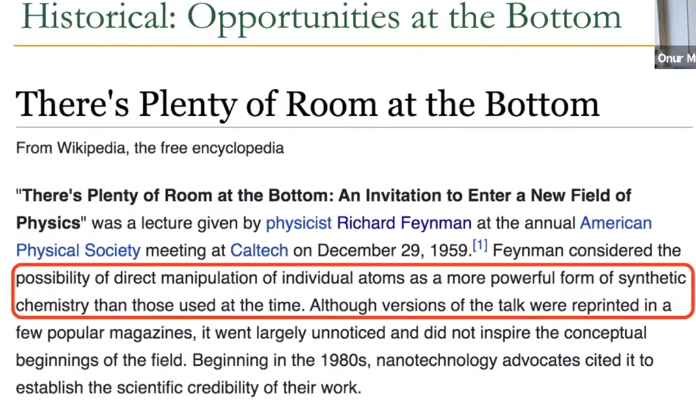 

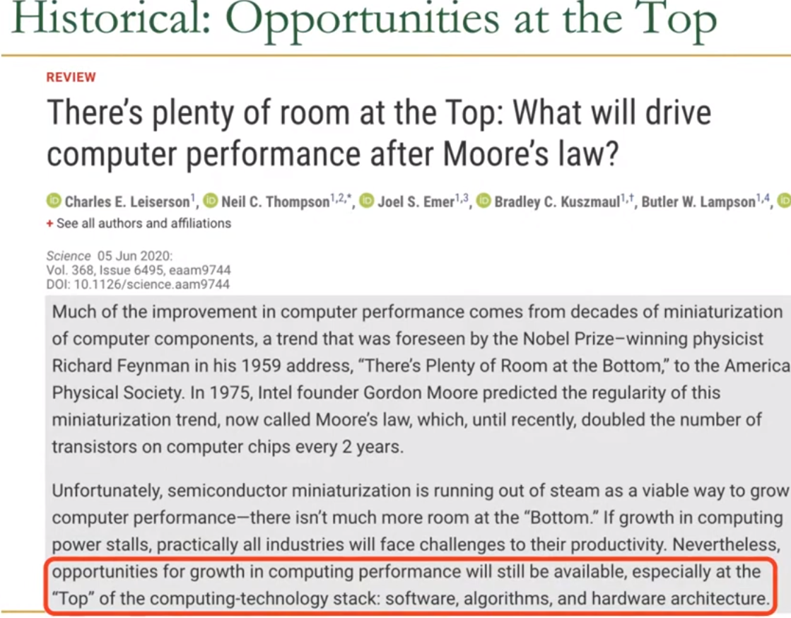 

# Cross-Layer Design / SW-HW Codesign
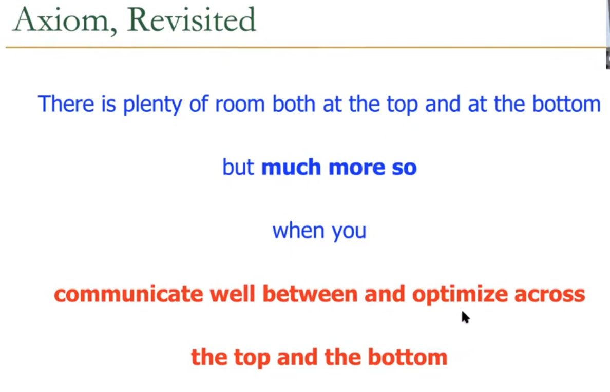

Here are some great examples of cross-layer design:

1. Near-Memory Processing Using FPGA in weather forcast.
2. Time Series Analysis Accelarator.
3. FPGA-Based Near-Memory Accelaration of Modern Data-Intensive Applications.

much accelaration and SW-HW codesign

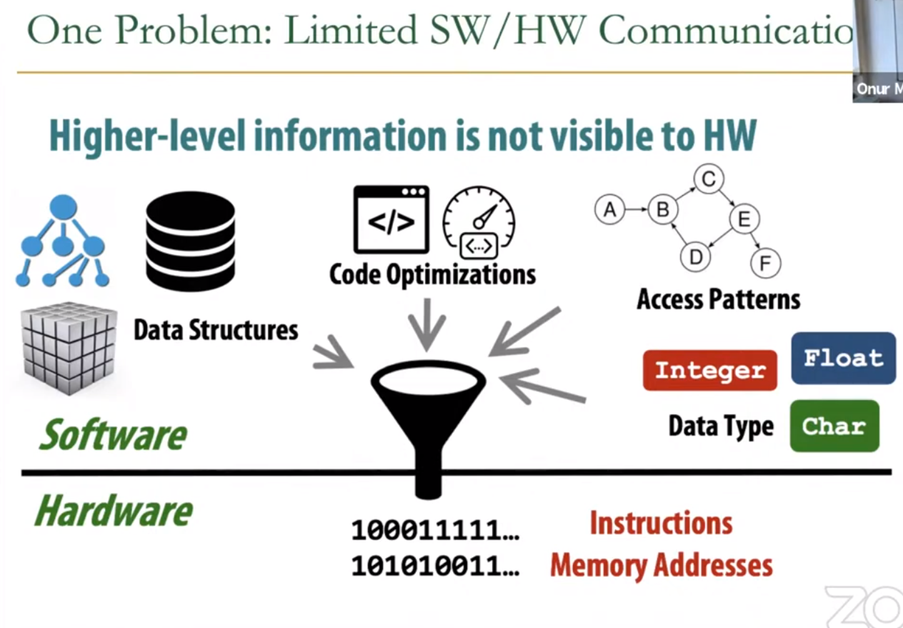 

<h3 style="color:cyan">

- The problem now is about interface design, in which SW/HW commnication is quite limited. We need more expressive interface.
- high-level information(A lot of information!) in software like access pattern, data structure are not exposed to hardware(lower level) in general purpose system.
- We might need to improve the interface to give hardware more context to do optimization.
- SW/HW co-design tries to eliminate this shortcoming. 

</h3>

For example, we can design
1. data-aware memory to reduce latency.

### More Expressive Interface
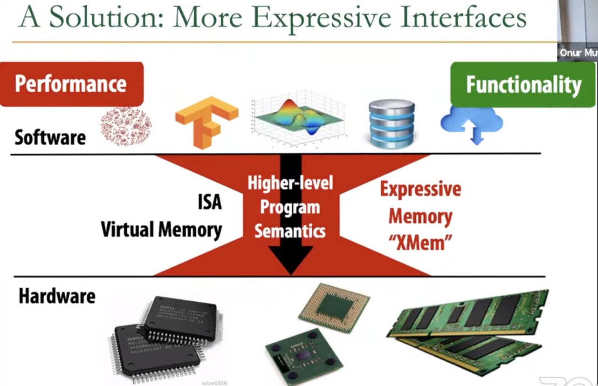
- Make higher-level program semantics visible to hardware and exploit that information to optimize the system.
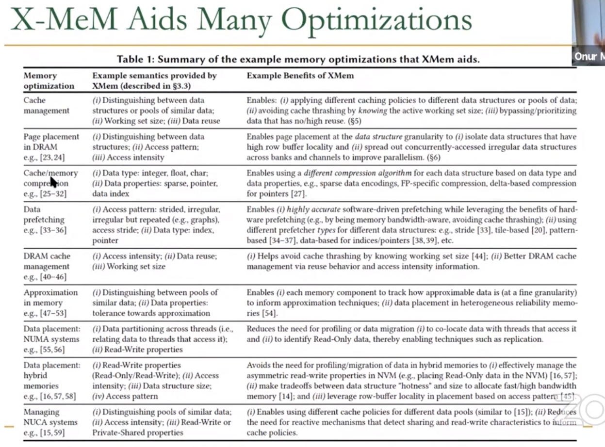

- Communication is a significant problem between hardware and software.
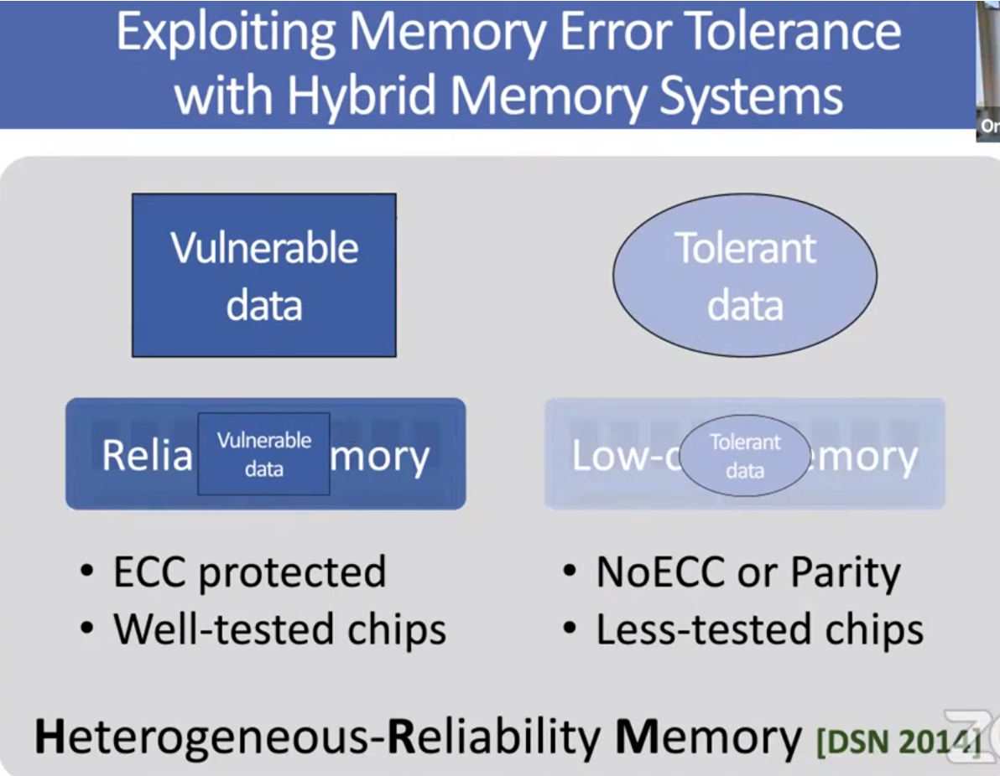
- Exploit more information of data.
- More scalable memory.

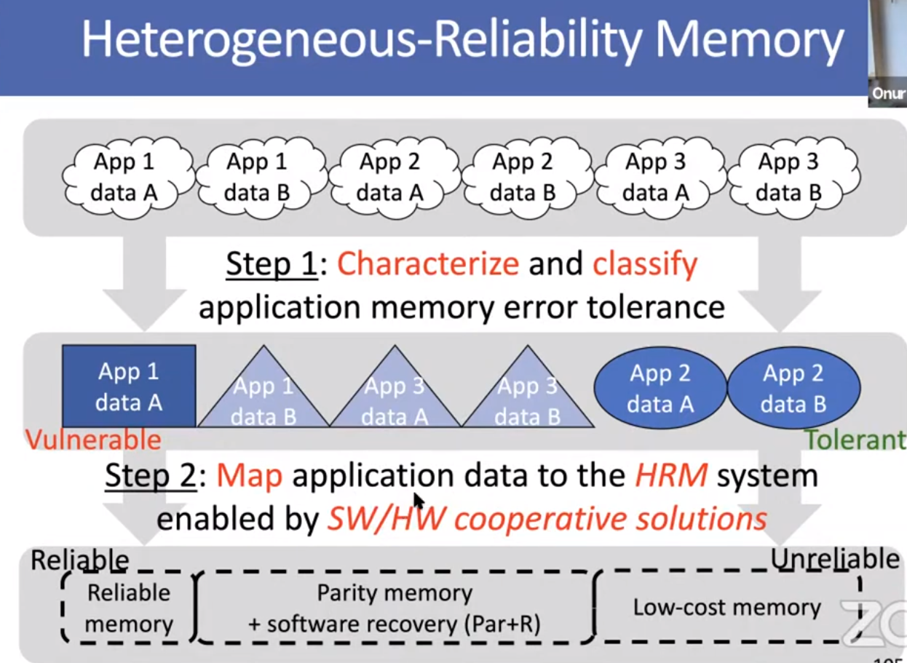
- Example of HW/SW collaboration

## New technology

1. Persistant(Non-volatile) Main Memory
2. Phase Change Memory to replace DRAM
3. Wafer Scale Engine (Largest ML accelerator)
4. Process-in-Memory Engine
5. Process-using-memory
    1. Bulk Data Copy and Initialization in DRAM
    2. In-DRAM True Random Number Generator