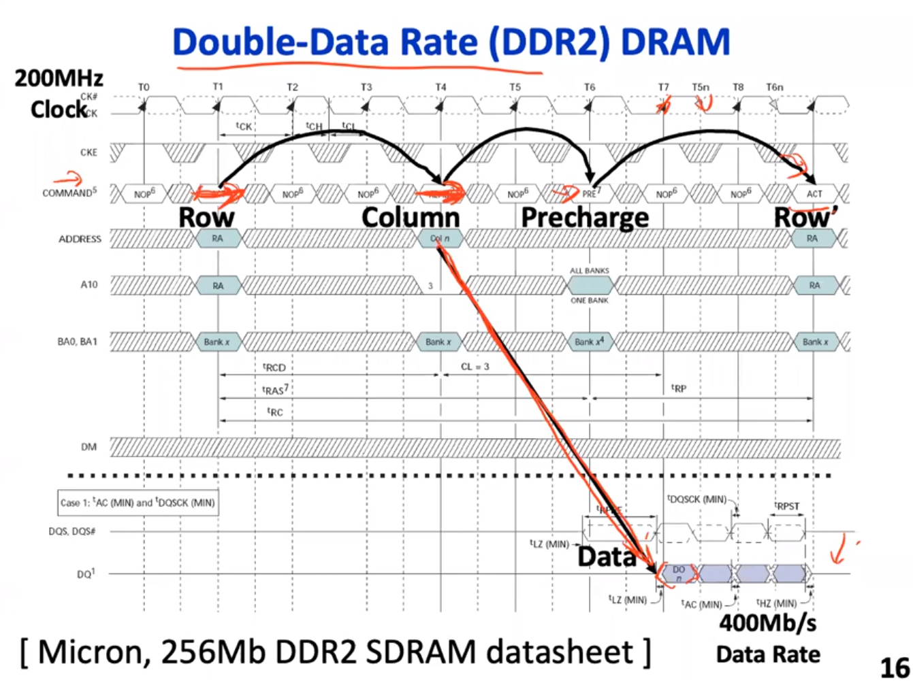

# Pipeline
## Resources
>
HCU: https://www.cse.cuhk.edu.hk/~byu/CENG3420/2016Spring/ 
>
>UCB: https://people.eecs.berkeley.edu/~pattrsn/252F96/(More advance)
>
>UCB: https://inst.eecs.berkeley.edu/~cs152/sp23/
>
>

### Instruction scheduling
> https://www.cs.cmu.edu/afs/cs/academic/class/15411-f20/www/lec/21-scheduling.pdf

### Trap

### Handling Principle

The principle of trap handling leverages the idea of speculation. Since the trap seldom occurs, we can reduce the overal latency by always predicting trap not to occur.

### Instruction Pipelined Cache

For instruction, we can directly use it before tag check is fully completed(RF stage in the figure), thus reduce the time of instruction fetch. However, if a cache miss occurs, we may need to flush the pipeline and reload the instrcution from the memory.

### Branch Delay Slot

### Cache Design and Buffered write
> https://people.eecs.berkeley.edu/~pattrsn/252F96/Lecture2a.pdf

### Advance Pipelining
> https://drive.google.com/file/d/1-2SpAD-7hnqqxqLfQL9vjGWPc0okbenI/view

### Decoupling in Pipeline

Use queues between "access" and "execute" pipeline to tolerate long memory lentency, thus accelerate the computation.

### CDC6000 architecture

#### Advantage

#### Issues in Complex Pipeline Control

CDC6600's solution to the complex pipeline control: Scoreboard.

### Insturction-Level Parallelism

#### Multiple Issue
Def: Expand each pipeline stage to accommodate multiple instructions.

<h3>"Static" typically means let's <u>our compiler</u> to take care of it.

"Dynamic" typically means let's <u>build some hardware</u> to take care of it.</h3>

>https://www.cse.cuhk.edu.hk/~byu/CENG3420/2016Spring/L11_MIssue.pdf

#### More Complex In-order Pipeline

- By delaying the commit point:

1. Write ports never oversubscribed.

2. We can stall the pipeline on long latency operations like cache miss.

3. Handle exceptions in-order at commit point.

#### MISD pipeline

Further exploitation of paralleraism increases throughput. For instance, this architecture can fetches two instruction per cycle and issues multiple functional units, here a integer computation unit and a floating unit, in execution.

### Architectural State
> https://en.wikipedia.org/wiki/Architectural_state#:~:text=Architectural%20state%20is%20the%20collection,registers%2C%20and%20the%20program%20counter.

### A summary of pipeline

### Microcoded vs Pipelined

one way to reduce hazard: Loop unrolling
Alternative approach: Decoupling Execution

CDC6600 Scoreboard
- read-after-write 
out of order execution
- write-

# Memory System

### Prologue - Datapath and Controller
Some random thoughts, just in mind. I always curious about how memory is implemented, even though in the simplest form it just comprises of a pile of registers and maybe a mux for locating the storage unit. But that seems too simplistc, since technology varies, take DRAM as an example, since you have to initiate row access, col access and precharge operations one by one, state element is necessary. Meanwhile, to support a inter-component communication in precessor, like between CPU and main memory which works under different frequency, pure combinational design seems incapable.

After some study, I realize that many functional modules, capable of executing a certain task and issue inter-module communication, can be conceptually divided into two part. 

One is the datapath,
responsible for performing arithmetic, logic, and data movement operations. It typically consists of registers, multiplexers, arithmetic logic units (ALUs), and other functional units. The datapath operates on data as it flows through the system, executing instructions and processing data according to the program's logic. 

While the datapath may involve sequential operations, it is not usually implemented as a state machine. Instead,<u> it consists of combinatorial logic circuits</u> that operate based on the control signals provided by the controller.

The other is controller, which directs the operation of the datapath and manages the sequencing of operations. It generates control signals that determine the operation of the datapath components based on the current state of the system and the instruction being executed. <u>The controller often implements a finite-state machine (FSM) or state machine design</u>, where the system behavior is modeled as a set of states and transitions between states.

## Dram

- In a row access, the sense amplifier "sense" the voltage change in each bitline and latch(or we say memorize) whole row of bits. Then a recharge is performed to restore the charge(state) in the storage cells.

- So sense amplifier bookkeeps the state in each storage unit(using some forms of memory element, like latches). In read operation, the selected column sends latched bit(stored in amplifier) out to the chip pins. And on write operation, we simply changes the value in latches to the required value.

- One bank manages one bit of data, and in one chip typically multiple banks are used(increase bandwidth).

### Operations

### Working State

### Memory Access Partten

### Q:Why DM is faster than FA?
It's my own opinion. In direct-mapped cache, to fetch a certain data, we first decode the address the select the cache line, then do the tag comparison and read the data. Here the tricky stuff is that we can do tag check and read in parallel!

But for fully-associative cache, we don't possess such parallelism, since before tag check we never know where the data is, so we cannot do them in the same time.

## Cache Optimization

### Cache Replacement Policy

- Since LRU needs more hardware to implement, especially for multiple ways senario, we won't use it in highly associative caches, but instead using Round-Robin policy.

### Cache-Pipeline Interaction

> One thing that really troubles me for weeks that I don't really understand the details of cache miss, of its influence on the pipeline execution, of the intricate interaction between pipeline, cache, and memory. 
>
>So far we already know that the time for read/ write memory takes much longer time than single CPU cycle, which indicate that when a cache miss happen, we need time for the memory access to finish. But since I don't know the specific implementation, I wonder in real world design whether a pipeline will be<u> stalled</u> or we simply expand the time of each pipeline stage, which now I see as the most inefficient, since it make the cache useless.
>
> Now I still have other questions, like how cache "know" the memory is ready, how data is transferred bewteen cache and memory(may be there are some techniques like buffer) and how cache communicate with the pipeline, since I now think CPU and memory must work under different frequencies, thus we need extra hardware to support asynchronous, inter-commponent commnication. Lucily, in EECS151 I see a promising approach that leverage the <u>handshake protocal, fifo, and state machine,</u> which I might cover in this article somewhere.

## Cache Structure and Multicycle Issue

<h3 style> Unlike instruction cache where we only perform read, we cannot write data cache before tag check is done, since once it is written, I think, it will contaminate the cache and it's impossibly hard to recover the state if the tag is finally invalid.
  
One thing to be mention is that the introduction of cache has implicitly change the write stage into  two cycle , one for tag check, and one for data write if hit, which might prolong the execution time for single instruction. To solve this issue, we have several techniques:
</h3>
 

## Pipelining Cache Write
<h3>Since it takes two consecutive cycles for a write operation, we can somehow pipeline the cache to optimize the throughput.  

The figure above shows the pipelined cache implementation.
In the first stage, we compare the tag and load data & address into a buffer (here a register to delay operation into the next cycle).
In the next cycle, we write the data if the tag is valid.

### Dependency Issue: Read after Load
---
The introduction of pipelining adds to the complexity of the cache, which is likely to cause some harzard. For example, in the pipelined cache shown above.

Now let's assuming executing<u> a store and a load</u> to the same address subsequently. Here we see the stored data is directed into the delaying buffer, then when the read is performed, in the second cycle, the correct data, I mean the data at that address after the execution of the load operation (we always assume that the former instruction has been finished), however, is still in the buffer, not in the memory.

Therefore, remember for a read operation we can fetch the data before the tag check is done(in case of tag invalid we simple restore the state somehow), we shall look up both the memory and buffer for the data. If it is in the buffer, we can fetch it simply and nothing new happens (maybe, I don't know now).

### Reduce Tag overhead

If tag is too large, it may takes much time for tag check. To reduce the tag overhead, we can simply make our cache line holds more data, thus shorten the tag. However, it introduces another problem, since read a whole bunch of cache line from memory is painful if cache line is large.

Therefore, we employ the idea of sub-blocks. Here on each cache miss, we no longer load the whole line of data from the memory, instead just a sub-block, thus decrease the miss penalty. 

We shall also add an extra valid bit to those sub-blocks to indicate whether the sub-block is valid or not.

### Cache - Hashmap Analogy

## Victim Cache
<h3>Direct-mapped caches have faster access time than set-associative caches. However, in direct-mapped caches, when multiple cache blocks in memory map to the same cache line, they end up evicting each other whenever one of them is accessed. This issue, known as the cache-conflict problem, arises due to the limited associativity of the cache.
  
The introduction of victim cache exploits the both advantages of DM and FA, decrease the hit time while effectively reduce the miss penalty.
</h3>

> Wikipedia: https://en.wikipedia.org/wiki/Victim_cache#:~:text=A%20victim%20cache%20is%20a,3%20or%20Level%204%20caches.

<h4>
Due to the problem of cache-conflict problem, we introduce the victim cache, which is placed between a direct-mapped cache(L1 here) and a highly associative (also larger) cache. When the line in the direct-mapped cache is evicted, instead put it in the the lower level of cache immediately, we can temporaily place them in a victim cache.

Let's look at an example, when a line has just been evicted is accessed. Since without victim cache we need to come into the next level of cache, the miss penalty is multiple cycle. But with a victim cache, we can simply look at victim cache immediately after cache miss, which takes only one cycle. We can also view a set in the victim cache serves as a backup set in the L1 cache, seemingly adding its associativity.

Besides, time to loop up the victim cache is relatively short, hence we can consult the victim cache before look up in the L2 cache.<h4>

## Phrased Cache and Way Prediction
> https://ieeexplore.ieee.org/stamp/stamp.jsp?tp=&arnumber=799456

>The paper above proposes a new approach using way prediction 
for achieving<u> high performance </u>and <u>low energy consumption </u> 
of set-associative caches. By accessing only a single cache 
way predicted, instead of accessing all the ways in a set, 
the energy consumption can be reduced. 

### Phrased Cache

The energy consumption of set-associative cache tends to 
be higher than that of direct-mapped cache, because<u> all the 
ways in a set are accessed in parallel although at most only 
one way has the desired data.</u> To solve the energy issue, 
Hasegwa et al. proposed a low-power set-associative cache 
architecture [5], which is referred to as phased cache in this 
paper. As shown in Figure l(b), the phased cache divides 
the cache-access process into the following two phases:

- First, all the tags in the set are examined in parallel, and no data 
accesses occur during this phase.
- Next, if there is a hit, then 
a data access is performed for the hit way.

### Way Prediction
The way-predicting cache speculatively chooses one way before starting the normal cache-access process, and then accesses the predicted way as shown in Figure 2(a).
- If the 
prediction is correct, the cache access has been completed 
successfully. 
- Otherwise, the cache then searches the other 
remaining ways as shown in Figure 2(b).

> Ref: In this paper, we have employed a MRU (Most Recently 
Used) algorithm for the way prediction. In case 
of a 16 KB four-way set-associative cache, the MRU region 
is only 4 KB. The MRU information for each set, which is a 
two-bit flag, is used to  speculatively choose one way from the 
corresponding set. These two-bit flags are stored in a table 
accessed by the set-index address. Reading the MKU information before starting the cache access might make cache 
access time longer. However, it can be hidden by calculating 
the set-index address at an earlier pipe-line stage [l]. In addition, way prediction helps reduce cache access-time due to 
eliminating of a delay for way selection. 

### Crtical Word First & Early Start
When a miss occurs in L1 cache,the pipeline will stall while we fetch the cache line from the next level of cache(in case is the L2). The efficiency of this process rely heavily on the width of the bus connecting L1 and L2 cache, as it directly affects the speed of data transfer. 

To determine its width, we essentially need to do some trade-off.

+ __small width__ -> more cycles required for data transfer.
+ __large width__ -> consume more space and energy.

Some architectures choose a 32-bit bus width for their L1 cache, with each cache line spanning 512 bits. As a result, filling the L1 cache may take as long as 16 cycles, posing a significant performance bottleneck. How do architects mitigate this challenge

> This technique is based on the observation that the processor normally needs just one word of the block at a time. This strategy is impatience: don’t wait for the full.

## Case Study: THE MIPS RIO000 SUPERSCALAR MICROPROCE
> https://ieeexplore.ieee.org/stamp/stamp.jsp?tp=&arnumber=491460

## Virtual Memory - Manage Memory at Page Granularity

### Base Design

### Page Translation Offers Protection

### Hierarchical Page Table

### Translation Lookaside Buffer

#### Design Principle

#### TLB miss
