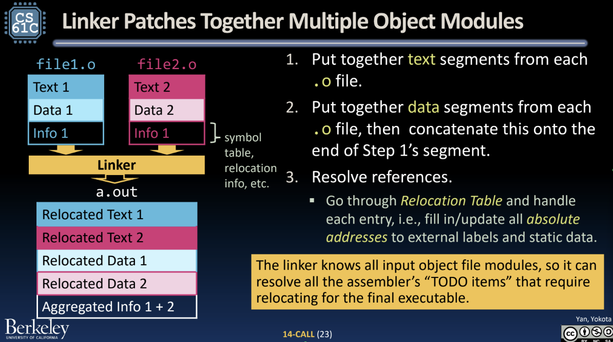
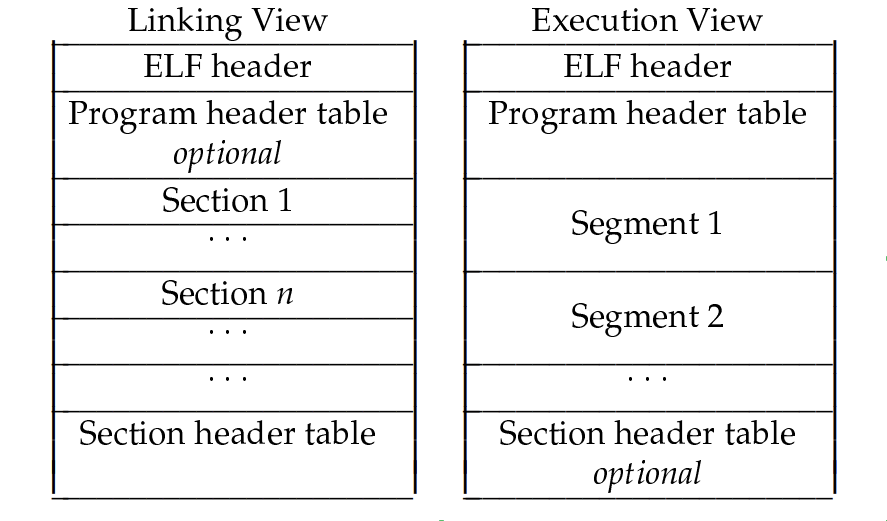

# Execuation Explained
## Overview
    https://www.youtube.com/watch?v=Ss2e6JauS0Y
    https://www.slideshare.net/AngelBoy1/execution-50215114 (recommended)

keyword: dynamic linker, rellocation, PIC, GOT, PLT

## Preliminary

### Unix Process Memory Layout
    https://www.geeksforgeeks.org/memory-layout-of-c-program/
 

keyword: section, segment, variable, allocation.

### Build Process
    CS61C:https://drive.google.com/file/d/1Gg1pKejSDy_dUPWdwQ1zuquI0RW8UKUu/view?pli=1
 

### Linker



### Memory Mapping


## Dynamic linking - Code sharing
    https://bottomupcs.com/ch09s03.html
    https://github.com/jserv/min-dl
    https://hackmd.io/@RinHizakura/S1tNA0RZv
keyword: virtual memory, shared library

## Elf specification
    ELF Document:
    https://www.cs.cmu.edu/afs/cs/academic/class/15213-f00/docs/elf.pdf

    ELF explained:
    https://www.youtube.com/watch?v=nC1U1LJQL8o

    Linker & Loader:
    https://www.cs.cornell.edu/courses/cs3410/2013sp/lecture/15-linkers2-w.pdf



### Lazy binding - Startup time reduction

    https://stackoverflow.com/questions/63745016/why-use-lazy-binding-for-position-independent-code-function-calls
    https://rafaelchen.wordpress.com/2017/09/25/pwn%e7%9a%84%e4%bf%ae%e7%85%89%e4%b9%8b%e8%b7%af-lazy-binding/#more-1244


### Position Independent Code
    https://docs.oracle.com/cd/E26505_01/html/E26506/glmqp.html
    https://bottomupcs.com/ch09s02.html#dynamic_linker_s2
> In an executable file, the code and data segment is given a specified base address in virtual memory. The executable code is not shared, and each executable gets its own fresh address space. This means that the compiler knows exactly where the data section will be, and can reference it directly.  
Consequently all libraries must be produced with code that can execute no matter where it is put into memory, known as position independent code (or PIC for short). Note that the data section is still a fixed offset from the code section; but to actually find the address of data the offset needs to be added to the load address.

### .got - Runtime symbol resolve
    https://bottomupcs.com/ch09s03.html


### _start - The entry point of the program
```
0000000000001050 <_start>:
    1050:       f3 0f 1e fa             endbr64 
    1054:       31 ed                   xor    %ebp,%ebp
    1056:       49 89 d1                mov    %rdx,%r9
    1059:       5e                      pop    %rsi
    105a:       48 89 e2                mov    %rsp,%rdx
    105d:       48 83 e4 f0             and    $0xfffffffffffffff0,%rsp
    1061:       50                      push   %rax
    1062:       54                      push   %rsp
    1063:       45 31 c0                xor    %r8d,%r8d
    1066:       31 c9                   xor    %ecx,%ecx
    1068:       48 8d 3d d1 00 00 00    lea    0xd1(%rip),%rdi        # 1140 <main>
    106f:       ff 15 63 2f 00 00       call   *0x2f63(%rip)        # 3fd8 <__libc_start_main@GLIBC_2.34>
    1075:       f4                      hlt    
    1076:       66 2e 0f 1f 84 00 00    cs nopw 0x0(%rax,%rax,1)
    107d:       00 00 00 
```

### __libc_start_main - Initialization funtion
    https://hammertux.github.io/libc-start
    https://bottomupcs.com/ch08s08.html#startup
Signature of __libc_start_main.
```C
int __libc_start_main(int (*main)(int, char *[], char *[]), int argc, char *argv[], void (*init)(void), void (*fini)(void), void (*rtld_fini)(void), void *stack_end) {
    // Perform initialization tasks here
    // ...

    // Call the main function
    int result = main(argc, argv, environ);

    // Perform cleanup tasks here
    // ...

    return result;
}
```
keyword: __libc_start_main, .init, .fini, __do_global_ctors_aux

## Appendix
### Stack allocation padding and alignment - Performance
    https://stackoverflow.com/questions/1061818/stack-allocation-padding-and-alignment

keyword: cache block size, data structure alignment, performance.
### \_\_Attribute__
In C, \_\_attribute__ is a keyword-like syntax extension that allows you to provide additional information or directives to the compiler about various attributes of a function, variable, or type. 
```C
void __attribute__((constructor)) program_init(void)  {
  printf("init\n");
}

void  __attribute__((destructor)) program_fini(void) {
  printf("fini\n");
}

int main(void)
{
  return 0;
}

$ gcc -Wall  -o test test.c

$ ./test
init
fini
```

