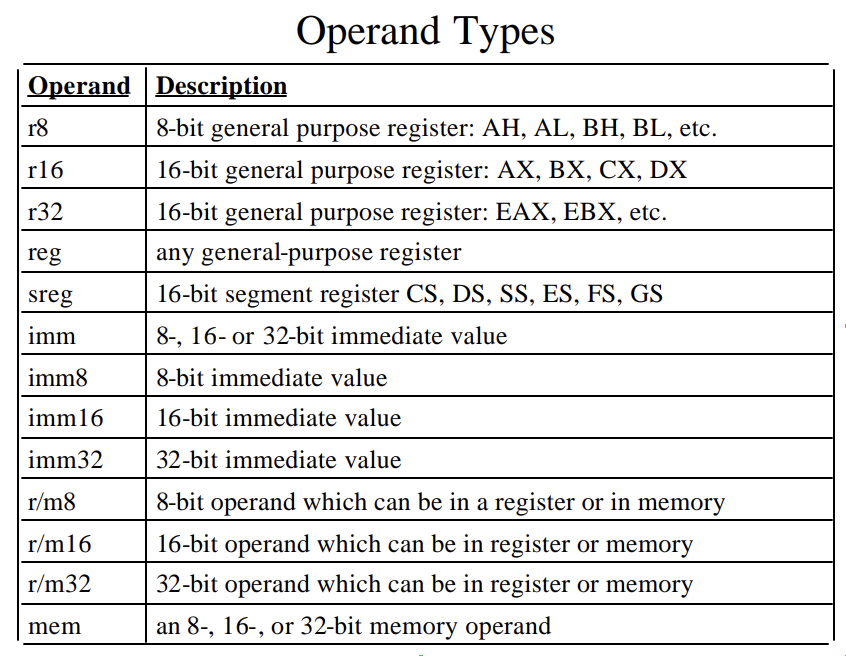

## i386 Overview
    https://cs162.org/static/dis/0.pdf

    Instructions:
    https://www.gpcet.ac.in/wp-content/uploads/2017/02/MPI-LECTURE-NOTES-II-II-R15_2.pdf

keyword: GPR, calling convention, CISC

## Calling convention
    https://stackoverflow.com/questions/9268586/what-are-callee-and-caller-saved-registers

## Operand Types and Addressing Modes
    https://home.adelphi.edu/~siegfried/cs174/174l4.pdf

## Elf specification
    ELF Document:
    https://www.cs.cmu.edu/afs/cs/academic/class/15213-f00/docs/elf.pdf

    ELF explained:
    https://www.youtube.com/watch?v=nC1U1LJQL8o

    Linker & Loader:
    https://www.cs.cornell.edu/courses/cs3410/2013sp/lecture/15-linkers2-w.pdf

## Compile i386 code with nasm
    https://gist.github.com/yellowbyte/d91da3c3b0bc3ee6d1d1ac5327b1b4b2

## Objdump
    https://web.mit.edu/gnu/doc/html/binutils_5.html
> Objdump is a command-line utility that is commonly used in software development and debugging processes, which provides detailed information about the contents of object files, executable files, and shared libraries.

## Useful commands
 - readelf
 - 

