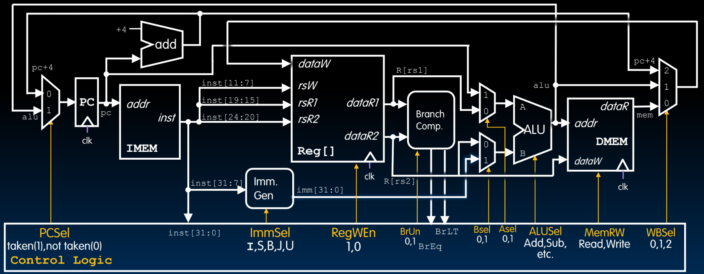
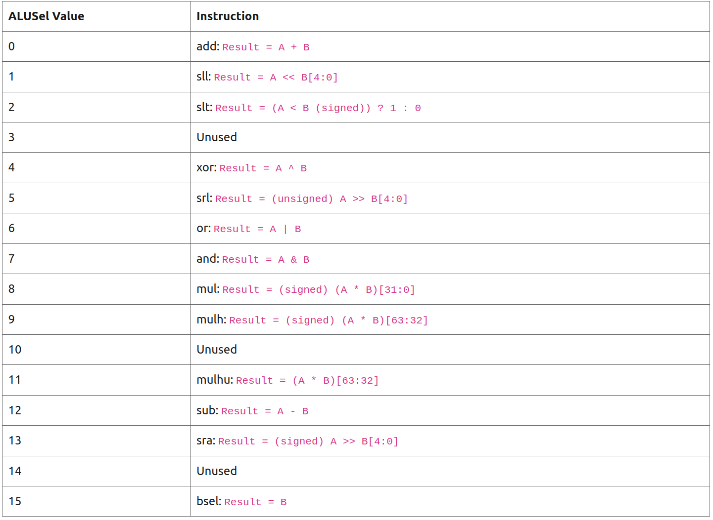
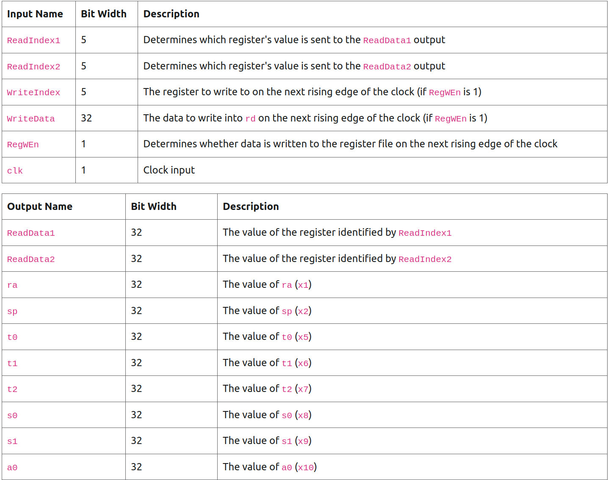

# RISC-V CPU
In this project, our objective is to construct a RISC-V CPU from bottom up. We will gain in-depth understanding about all the necessary building blocks and explore the intricate interconnection between them.

Through the task, we aim to develop a functional CPU that can support various running programs.
## BIG PICTURE



## RESOURCE

> CS61C: https://cs61c.org/sp24/projects/proj3


## TASK1 ALU
As we will see, CPU performs a wide range of complex tasks through intensive computations. There computations are facilitated by a set of combinational digital circuit, all integrated into a single component known as Arithmetic Logic Unit(ALU).

ALU provides support for various predefined operations, both arithmetic or bit-wise, on integers. It features two ports for operands, one port named Opcode that enables the selection of the desired operation, and some other ports to indicate its current status.


### INTERFACE


> https://cs61c.org/sp24/projects/proj3/part-a/#task-1-arithmetic-logic-unit-alu


### IMPLEMENTATION
```verilog
module alu32(alusel, A, B, result, ZF);
  input [3:0] alusel;
  input [31:0] A;
  input [31:0] B;
  output reg [31:0] result;
  output ZF;

  wire signed [31:0] mul;
  wire unsigned [31:0] mulhu;
  wire signed [31:0] mulh;
  multiplication uut(.A(A),.B(B),.mul(mul),.mulh(mulh),.mulhu(mulhu));

  assign ZF = (result == 0);
  always @ (*) begin
    case(alusel)
      0: result <= A + B;
      1: result <= A << B[4:0];
      2: result <= ($signed(A) < $signed(B)) ? 1 : 0;
      4: result <= A ^ B;
      5: result <= A >> B[4:0]; //shift right logic
      6: result <= A | B;
      7: result <= A & B;
      8: result <= mul;
      9: result <= mulh;
      11: result <= mulhu;
      12: result <= A - B;
      13: result <= A >>> B[4:0];
      15: result <= B;
      default: result <= 32'bx;
    endcase
  end
endmodule
```

## TASK2 REGFILE

### INTERFACE
> https://cs61c.org/sp24/projects/proj3/part-a/#task-2-register-file-regfile



### IMPLEMENTATION
```verilog
`include "utils/N_register.v"
`include "utils/decoder.v"

module regFile(
  input [4:0] ReadIndex1,
  input [4:0] ReadIndex2,
  input RegWen,
  input rstn,
  input clk,
  input [4:0] WriteIndex,
  input [31:0] WriteData,
  output [31:0] ReadData1,
  output [31:0] ReadData2,
  output [31:0] ra,
  output [31:0] sp,
  output [31:0] t0,
  output [31:0] t1,
  output [31:0] t2,
  output [31:0] s0,
  output [31:0] s1,
  output [31:0] a0);

  wire [31:0] Sel;
  wire [31:0] WriteSignal;
  wire [31:0] registers [31:0];
  integer j;

  decoder #(5) dec(WriteIndex, Sel);
  assign ReadData1 = registers[ReadIndex1];
  assign ReadData2 = registers[ReadIndex2];
  
  assign ra = registers[1];
  assign sp = registers[2];
  assign t0 = registers[5];
  assign t1 = registers[6];
  assign t2 = registers[7];
  assign s0 = registers[8];
  assign s1 = registers[9];
  assign a0 = registers[10];

  genvar i;
  generate for(i = 0; i < 32; i = i + 1) begin
    assign WriteSignal[i] = Sel[i] && RegWen;
    N_Register #(32) uut(.d(WriteData), .rstn(rstn),
     .RegWen(WriteSignal[i]), .clk(clk), .Q(registers[i]));
    end
  endgenerate

endmodule
```
## TASK3 MAIN MEMORY

### IMPLEMENTATION
```verilog
module memory #(parameter ADDR_WIDTH = 8)(read_addr, write_addr, 
WriteWord, WriteSel, MemRW, clk, Word, Half, Byte);
  parameter WORD_SIZE = 32;
  input [ADDR_WIDTH-1:0] read_addr; //addr bus
  input [ADDR_WIDTH-1:0] write_addr;
  input [WORD_SIZE-1:0] WriteWord; //word alignment

  input MemRW; //1 for write, 0 for read.
  input [1:0] WriteSel; //0 for read Word, 1 for Half, 2 for Byte;
  input clk;

  output reg [WORD_SIZE-1:0] Word;
  output reg [WORD_SIZE/2-1:0] Half;
  output reg [7:0] Byte;

  wire [ADDR_WIDTH-1:0] Word_sel;
  wire [ADDR_WIDTH-1:0] W_Word_sel;
  wire [ADDR_WIDTH-1:0] W_Half_sel = {write_addr[ADDR_WIDTH-1:1], {1'b0}};


  assign Word_sel[ADDR_WIDTH-1:2] = read_addr[ADDR_WIDTH-1:2];
  assign Word_sel[1:0] = 2'b0;
  assign W_Word_sel[ADDR_WIDTH-1:2] = write_addr[ADDR_WIDTH-1:2];
  assign W_Word_sel[1:0] = 2'b0;

  integer i;
  reg [7:0] MME [2**ADDR_WIDTH-1:0];

  initial begin
    for(i = 0; i < 2**ADDR_WIDTH; i = i + 1) begin
      MME[i] = 8'b0;
    end
  end
  
  always @ (posedge clk) begin
    if(MemRW) begin
      case(WriteSel)
        0:begin
            MME[W_Word_sel] <= WriteWord[7:0];
            MME[W_Word_sel+1] <= WriteWord[15:8];
            MME[W_Word_sel+2] <= WriteWord[23:16];
            MME[W_Word_sel+3] <= WriteWord[31:24];
          end
        1:begin
            MME[W_Half_sel] <= WriteWord[7:0];
            MME[W_Half_sel+1] <= WriteWord[15:8];
          end
        2:MME[write_addr] <= WriteWord[7:0];
      
      endcase
    end
  end

  always @ (read_addr) begin
    Word = {MME[Word_sel+3], MME[Word_sel+2], MME[Word_sel+1], MME[Word_sel]};
    Half = read_addr[1] ? Word[WORD_SIZE-1:WORD_SIZE/2] : Word[WORD_SIZE/2-1:0];
    Byte = MME[read_addr];
  end
endmodule
```

## TASK4 IMMEDIATE GENERATOR
### IMPLEMENTATION
```verilog
module immGen(
    input [31:0] inst,
    input [2:0] immsel,
    output reg [31:0] result
);

  always @(*) begin
    case(immsel) 
        0: result = {{20{inst[31]}},inst[31:20]};//I type
        1: result = {{20{inst[31]}},inst[31:25],inst[11:7]};//S type
        2: result = {{19{inst[31]}},inst[31],inst[7],inst[30:25],inst[11:8],{1'b0}};//SB type
        3: result = {inst[31:12],12'b0};//U type
        4: result = {{11{inst[31]}},inst[31],inst[19:12],inst[20],inst[30:21],1'b0};//UJ type
    endcase
  end

endmodule
```

## TASK5 CONTROL LOGIC

## RISC-V INSTRUCTION SET
