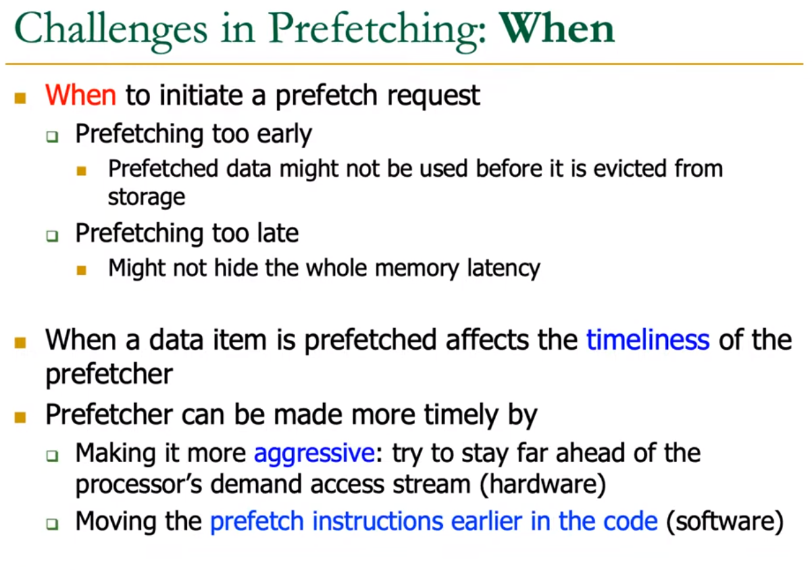
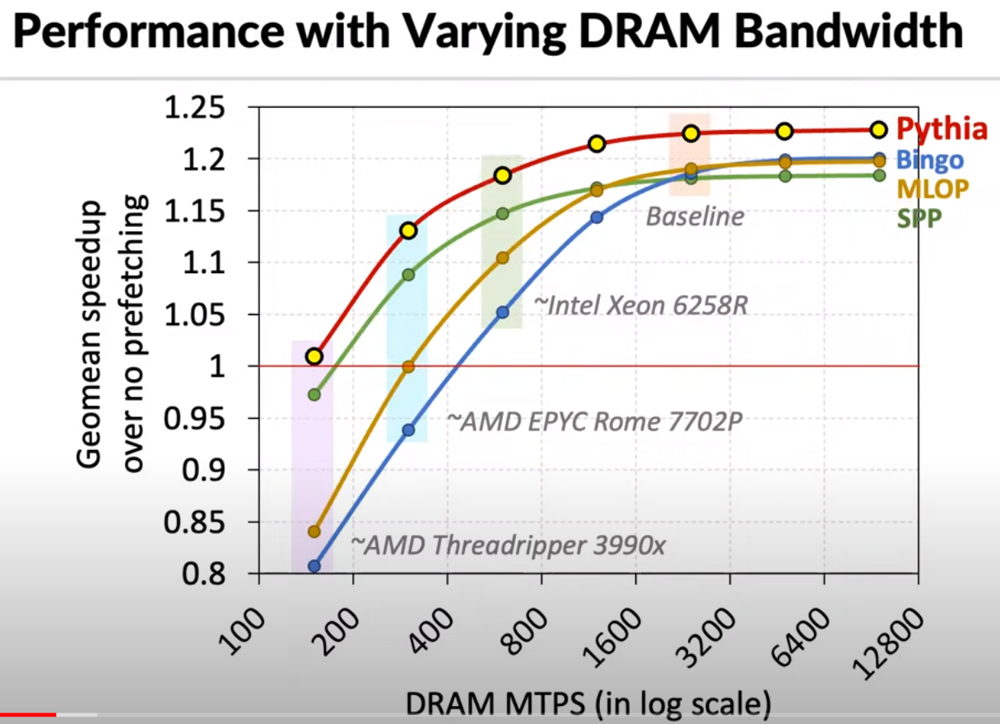
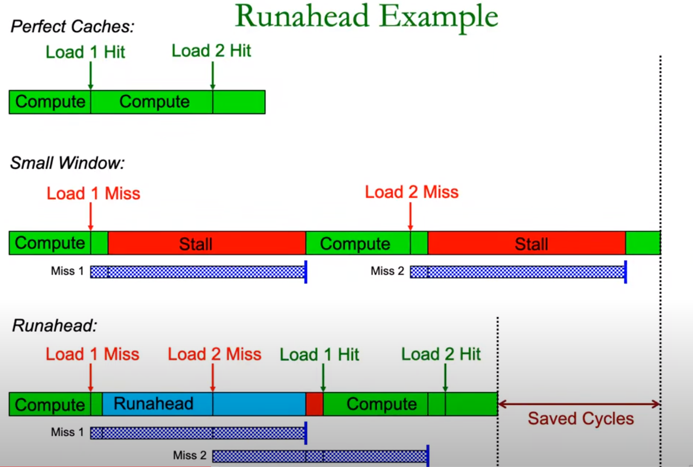

https://www.youtube.com/watch?v=cLTCEOrB428&list=PL5Q2soXY2Zi-EImKxYYY1SZuGiOAOBKaf&index=29

### Better Replacement Policies

Other cache misses might influence the current miss at the same time. For example, a parallel miss can reduce cost significantly through overlapping latency with other misses and isolated miss cost the most.

- Traditional cache management policies not take this into consideration. They merely try to reduce miss count.

### Cache in Multi-Core System

- Cache sharing might be unfair. In this example, one core might takes the most of the cache space.

### Cache Coherence

- P1 tell directory to modify x;
- directory looks at all the processors if x is kept by someone.
- If P1 holds the only copy, then modify x is allowed.
- Need data structure to maintain this information.
- directory itself can be cached.
- Much lower latency and not scalable in many-core situation.

- P is the number of processors.
- Have to invalidate the valid bit in: 
    1. all other caches that holds that block.
    2. directory.

### Prefetching

https://www.cs.cmu.edu/~srallen/proposal.pdf

Fetching instructions from memory only as they are needed may cause unnecessary delays due to the
cache/memory speed difference in modern memory hierarchies. Instruction prefetching mitigates this delay
by preemptively requesting blocks of potential future instructions from memory, even if they may not be
executed. 

One cannot simply prefetch all instructions, as the instruction cache is limited and doing so may
result in more cache misses. 

Note that Instruction prefetching is complementary to data prefetching because
modern architectures maintain separate instruction and data caches, meaning the two processes are unlikely
to substantially interfere with one another.

- If we put data early in the cache, then the memory latency will be reduced with bandwidth improved.
- The prefetched data can be put either in cache or prefetch buffer.
- Cache block may be invalidate by other processor due to cache coherence protocal. Not always cache misses can be eliminated.
- Employ the idea of speculation - predicting which address will be accessed later before it is needed.

### Capacity & Latency Trade-Off
- This trade-off leads to memory hierarchy.
- Larger cache means higher latency.
- Use Prefetching to hide the latency of memory.

### Metrics

### Effect of Prefetching

### Ways of Prefetching

 
  
   

### Execution-Based Prefetching
  
 ### Out-of-Order Execution Issues
  
 - small istruction window with long cache miss, execute a little bit, then when window is full, the processor will stall until data come from memory.
 - Today’s high performance processors tolerate long la-
tency operations by means of out-of-order execution. How-
ever, as latencies increase, the size of the instruction win-
dow must increase even faster if we are to continue to tol-
erate these latencies.

- We have already reached the point
where the size of an instruction window that can handle
these latencies is prohibitively large, in terms of both de-
sign complexity and power consumption. And, the problem
is getting worse.

  

 
### Runahead Execution

- Speculative Execution.
- Overlap latency.
- Not exposed to programmer.

 

### Limitations

 

# Virtual Memory

### Abstraction

### Benefit

### Virtual Page

