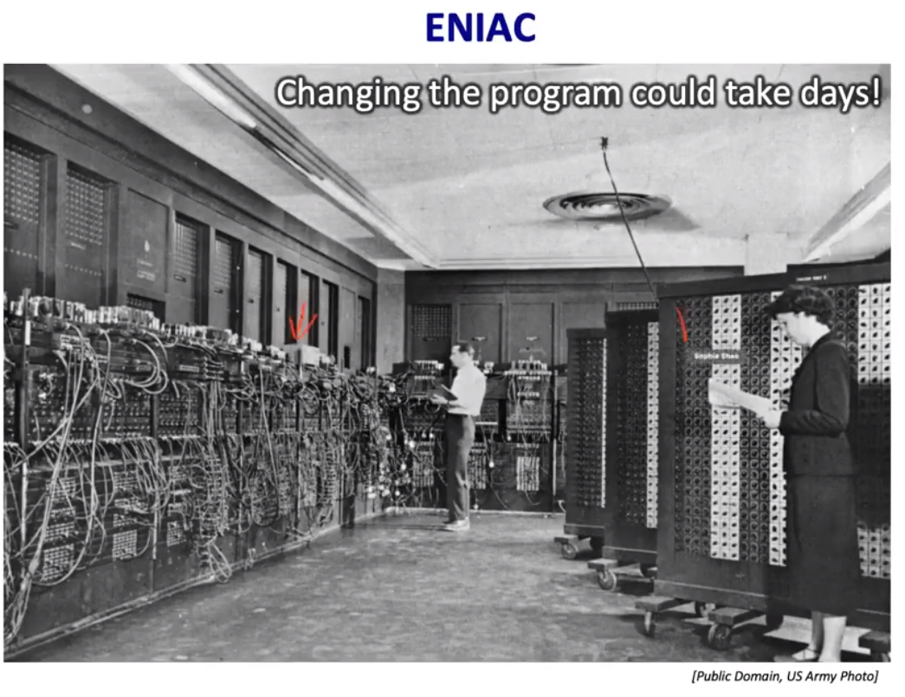

## Historical Progress
### Programmability in Early Machine


- In early computer, it takes days to changing the program since you have to reconfigure the hardware. Which means low programmability.
- Then Von Neumann proposed the idea of<b> stored program</b> to accelerate programming.
- After stored program machine was built, the idea of <b>subroutine</b>, or library became prevalent.

### Compatibility


- In early incompatible families of computer of IBM, each system had its own instruction set & software stack & own implementation.
- Hard to manage, making development really complex.
- Hence <b style="color:green">separate ISA from the implementation</b> to reduce overhead to maintain different versions in IBM360.
- In IBM360, byte is defined as 8 bits for better effiency in information encoding and general purpose registers were introduced to expand functionality of early machines.


- Different models share the same instruction set.
- Software stack can be shared - better compatibility.
- A layer of abstraction hides all the technological difference -> difficulty of development reduced hugely.

## Components in A Computer


- In order to build a computer, we need an <b>execution model for processing computer program.</b>
- Von Neumann model is one of them.
- Communication Unit refers to the set of wires or buses that use for transfer data between different components or devices.

## Program, AOE Network, and Instruction Dependency
- We all see that the position of some instructions in the code can be rearranged, but some cannot. So what's the reason? 


### AOE Network and Dependency Relationship
We write program to solve real world problem. Typically, to solve such a problem, multiple activities should be performed in some sort of order, based on their dependency relationships. For example:

If we have 5 clothes to wash, dry, and finally put them back to the garment rack, then for each cloth, we have to perform those activities sequentially.

To represent those activities and their dependency relationship, a powerful tool called AOE network can be used.

An AOE network is a type of directed graph where the edges represent activities and the nodes represent events or milestones. This network helps in visualizing the sequence of activities and their dependencies.

Components of AOE Network:

- Nodes (Vertices): Represent milestones or events that occur at the start or end of activities. For example, in the clothes washing example, a node might represent the event "start washing" or "finished drying."
- Edges (Arcs): Represent the activities that need to be performed. Each edge is directed, showing the flow from one node to another, indicating the sequence in which activities need to be completed. The weight of the edge can represent the time or cost associated with the activity.


### Map AOE Network to Computer Program

- Programs are executed by computer to solve real world problem.
- The solution of problem can be represented by an AOE network.
- To solve the problem, the computer just needs to complete the AOE network. Hence we have to map AOE Network into computer program.

How to map AOE Network?

- Each edge can be mapped to one or a series of commands.
- Computer can executed those commands in any way, as long as it finishes the whole network and abide the restriction on activities imposed by dependency relationship between them.

### Data Dependency

When the execution of one instruction relys on the results of a previous instruction, a data dependency issue arises, and we have to wait the previous instruction to complete before we start to execute the current instruction. Here are 3 types of data dependency:

- True Data Dependency (Read-After-Write): This occurs when an instruction needs the result of a previous instruction as an operand. For example, if instruction A writes a value to a register, and instruction B reads that same register, there is a true data dependency between A and B.

- Anti-Dependency (Write-After-Read): This occurs when a later instruction writes to a resource (e.g., a register) that an earlier instruction has read from. This can lead to issues if the instructions are reordered or executed concurrently.

- Output Dependency (Write-After-Write): This occurs when two instructions write to the same resource (e.g., a register). The order of these instructions must be preserved to ensure the correct final value is stored.


### Execution Model
As we mentioned before, no matter in what order or way, as long as computer finishes the whole network and doesn't violate any dependency relationship, the problem will be solved nicely. But how should computer execute those edges while not violate those dependencies?

The most common way is through topological sorting.

- We can serialize those activities through topological sorting.
- Then according to the result of the topological sorting, we string the instructions of those activities together.

That's basically how we solve the programming problem in single thread environment. We divide task into smaller parts, write code or function for each of them and execute them sequentially.

- That's why the place of some code can be rearranged, as long as data dependencies are not broken. Let's see a example. Here we assume that the instruction is executed sequentially and atomically.
```c
    int c = 1;
    int a = c;
    int b = 2;
    c = a * b;
    int d = b * c;

    -------------- reordering:

    int b = 2;
    int c = 1;
    int d = b * c;(violate the dependency, since c is not complete)
    int a = c;
    c = a * b;

    -------------- reordering:

    int c = 1;
    int b = 2;
    int a = c;
    c = a * b;
    d = b * c; 
                ok! data dependency is perserved.

```

## Von Neumann Model

### Block Diagram of Von Neumann Model


### Memory


Memory Bus Interface:
- MAR
- MDR


### Processing Unit
- The processing unit performs the actual computations, which consists of multiple <b> functional units.</b>

<span style="color:green"></span>

- Simplest Case: Arithmetic and Logic Unit(ALU), which only executes <b>integer</b> arithmetic and logic operations.


- Memory is large but slow.
- Registers in Processing Unit ensures quick access to operands.
- <span style="color:green">Register File</span> is a set of registers that can be manipuated by the instructions. Note that not all the internal registers are in register file.

### Control Unit
- Control Unit coordinate the control-flow of instructions. It keeps track of which instruction being processed and which instruction to process next with two special regitsers.
- Control Unit generate control signals for other modules in the machine.


### Architectual State
- Programmer should only cares about what is visible.
- What instruction operates on are all programmer-visible. Instructions <b>specify</b> how to transform the value of programmer-visible state.(Note that there are also programmer-invisible state, which will be covered in the microarchitecture, and instruction doesn't manipulate on it directly) 
- Main memory, architectural registers and PC are programmer visible. However, there are invisible components whose states are hidden from programmer.
- Programs essentially acts on architectural state.


### Key Property of Von Neumann Model
- Programs are stored inside the memory.
- The Program consists of a bundle of instructions.
- At the ISA level, the sequential execution of instructions is a fundamental architectural feature of Von Neumann model.
- The ISA defines the execution model where instructions must be executed one after the other, in the order they appear in the program. In other word, the processor promises that the instruction execution will<b> appear</b> to be<u> sequential and atomic.</u>
However, there may exist some alternative execution models which violates those properties.


## ISA Overview
- Hardware & Software Interface
- Instruction is the language of a computer.
- Instrcution Set is the vocabulary.


### ISA Trade-Off


#### Processing Model
---
##### Sequence Model

- From the programmer's perspective, the processor behaves as a well-defined FSM, following the sequential execution model specified by the ISA.
- We can introduce programmer-invisible state to optimize the execution.


- ISA defines the transition of architectural state.

- uarch implements the state transfer while hides the intermediate states from programmers.


<b> Why Sequential Processing? Here are the reasons.</b>

- Simplicity and Reasoning:
It provides a straightforward, intuitive way to understand program behavior.This simplicity makes it easier to debug, verify, and reason about program correctness.
- Architectural Abstraction:
The sequential model is a key part of the Instruction Set Architecture (ISA).
The ISA abstracts away microarchitectural complexities, enabling hardware-independent software.

- Determinism:
Sequential execution ensures predictable, reproducible program outputs.
This determinism is essential for software correctness, debugging, and testing.

- Tool Support:
Compilers, assemblers, and other tools are well-optimized for the sequential model.

- Hardware Implementation:
The sequential model is simpler to implement in hardware, reducing complexity and cost.

If a program is not sequential and atomic, it's almost impossible for us to debug and program.

---

##### Dataflow Model


- We need an execution model to process the program.

---

## ISA Microarchitecture Level Trade Off


- we can implement an microarchitecture that internally executes the program out-of-order but report the result of each instruction sequentially to the programmer.

## Conclusion


- Today we often refer Architecture as ISA plus Microarchitecture.

