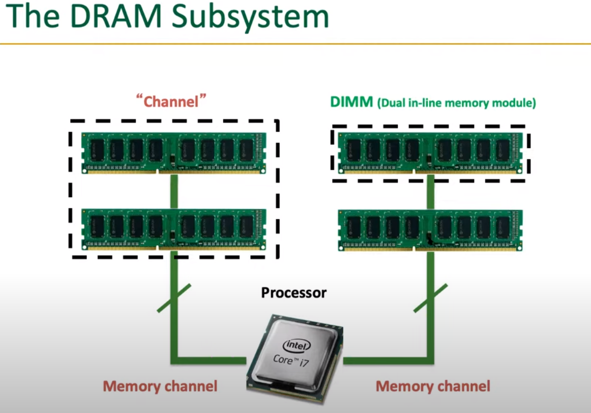

## Memory Overview
<b style="color:green">Memory system has been the most important part in the computer achitecture in these days, though a lot of people don't understand it.</b>

### Mmeory in a Modern System

- Memory takes the most of area on chip.

### 

- On-chip memory greatly improves bandwidth by reducing the need of massive data transfer on bus or whatever, which is quite inefficient since bus is long and slow.
- However, since on-chip memory is small, we still need to get data from off-chip memory when training large models.

## Performance View

### Memory is Critical for Performance

1. Lantency.
2. Bandwidth.

- Most of lantency in OoO execution is memory <b style="color:green">latency</b>.
- Many memory banks are needed to maintain <b style="color:green">throughput</b> in SIMD processors.
- Hence we need fast & temporary storage close to computation unit, which's the idea of cache.

### Why Memory is Important?

- Many applications needs strong memory system & And a lot of data is generated today, we need some ways to process them.
- Carry tons of data to processor, which involves a lot of slow data movement.
- AI need data to train various models.
- Nowadays we need to process more and more data, which is supplied by the memory system.
- Huge demand for more efficient memory.
- <b style="color:green"> Data movement is slow.</b>
- <b style="color:green">Memory become a bottleneck for all kinds of applications.</b>

### New technique to Ease the Bottleneck

- Move the data intensive job from CPU to FPGA.
- Processing Unit near memory, reduces the need for moving data around.
- Specialized Processing Unit with dataflow execution on FPGA for specific tasks like matrix multiplication.

- <b style="color:red">Even with powerful processor, for the most time it is waiting for the data from memory!
</b>

Hence if we don't improve the performance of memory system, any optimization of processor will be futile. Here is the quote from <i> It's the Memory, Stupid. </i>

### Front End

- Instruction Cache reduces the memory access time (hundres of cycles) to only 1 cycle.
- Memory Subsystem fetches the data from main memory into caches.
- Branch Predictor determine which way to go when meet branch.

The main role of font end of CPU pipeline is to ensure that there are always enough instructions for the back end to execute. 

## Energy View

- Transistor is scalable: We know how to make transistor smaller.
- Memory is not scalable: Memory is about inter-connect, which can't be optimzed easily.

## Reliability View

- Greater density means smaller Dram cells, which makes them vulnerable to noises.
- Rowhammer, bit flip problem.

## Memory Organization

Programmers' view of memory is determined by the ISA. They do not see physical memory, but virtual memory, and physical memory is made transprant to them.

- Physical memory has a back store: disk;

### Idealism

### Array Organization

- Complex inter-connect inside memory adds to the lantency.

### General Structure

- The idea of memory cell: can be SRAM cell, DRAM cell or latches, whatever can hold bit.

### Building Larger Memories

- Requires larger memory arrays
- However, larger means slower.

- We introduce the idea of banking the memory.

- Concurrent access.

### DRAM System

- a channel is the collection
of all banks that share a common physical link (command, ad-
dress, data buses) to the processor. While banks from the same
channel experience contention at the physical link, banks from
different channels can be accessed completely independently
of each other.

### 3D-Stacking

- Optimize data movement.
- Fine-grained Connection between chips.

### The DRAM Subsystem

DRAM-based main memory:

> systems are logically organized as a hierarchy of channels, ranks,
and banks. In today’s systems, banks are the smallest memory
structures that can be accessed in parallel with respect to each
other. This is referred to as <b>bank-level parallelism.</b>

- At the highest level, we use memory channel to connect DIMM and processor.

- Each DIMM may contain 2 ranks, each rank is a collection of 8 chips.

- 64-bit data bus.

- Each chip provides 8-bit output, and we aggregate them to obtain 64 bits.
- Why we organize these chips in this way? Because each chip has limited pins(pin is expensive).

- Each chip contains 8 banks, same as what we saw in SIMD lecture.

- The number of columns & rows are not necessarily the same.
- Each column may contain 1 Byte.

- If row buffer hit, then fetch data from it directly. If miss, then launch a access to the memory array.

- From memory controller's perspective, the DRAM bank looks like figure a. However, it is implemented as shown in figure b internally.

- Although the DRAM system offers varying degrees of parallelism at different levels in its organization, two
memory requests that access the same bank must be served one
after another. To understand why, let us examine the logical organization of a DRAM bank as seen by the memory controller.
- most of the performance
benefits of having multiple banks can be achieved at a signif-
icantly lower cost by exploiting the potential parallelism of-
fered by subarrays within a bank.

- Subarrays are together called a MAT.

- Normally a cache block(64B here) maps to a single DRAM rank so that it can be accessed quickly. If it maps to different ranks, not good.

- Here we want to transfer 64B from DRAM to cache, with the cache block maps into one rank. Notice that the bus width is 64b, we should launch 8 consecutive I/O.