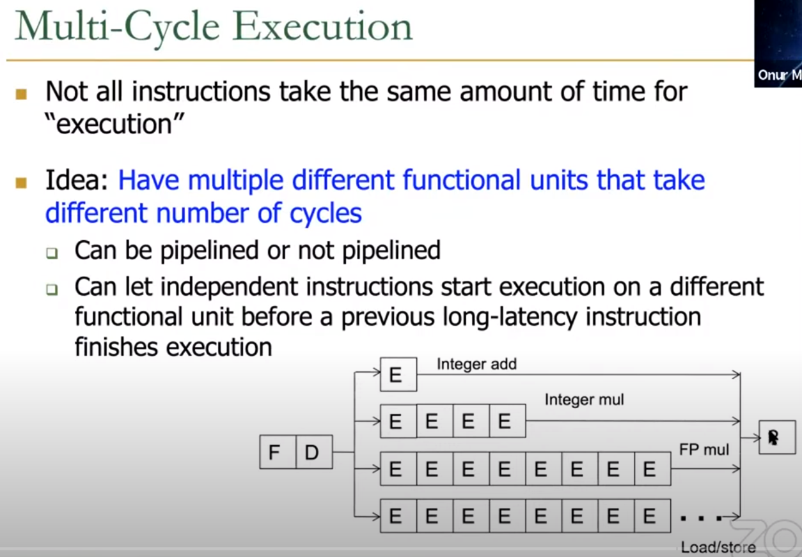
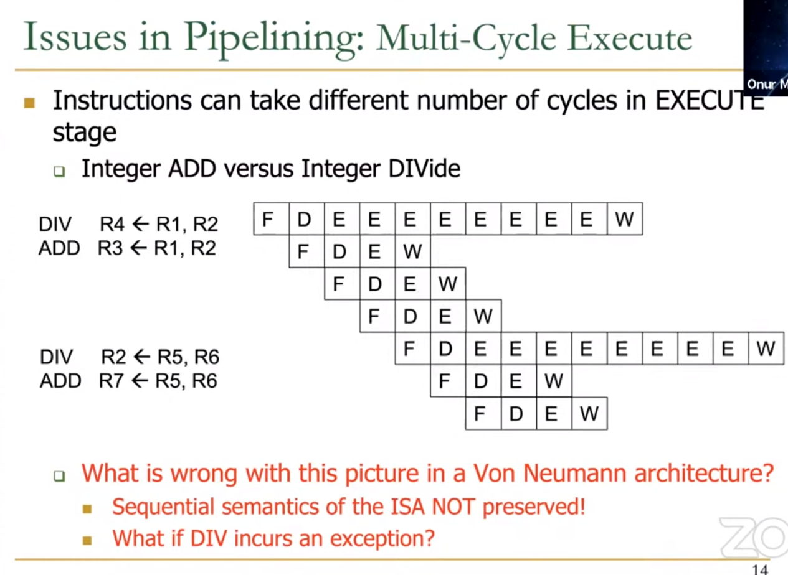
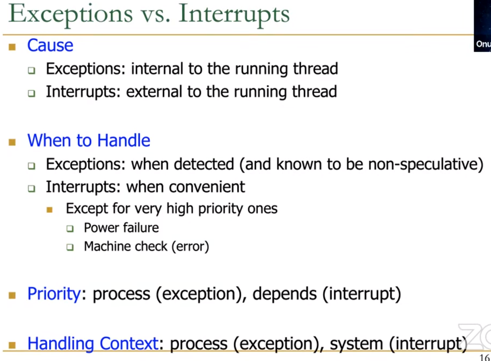
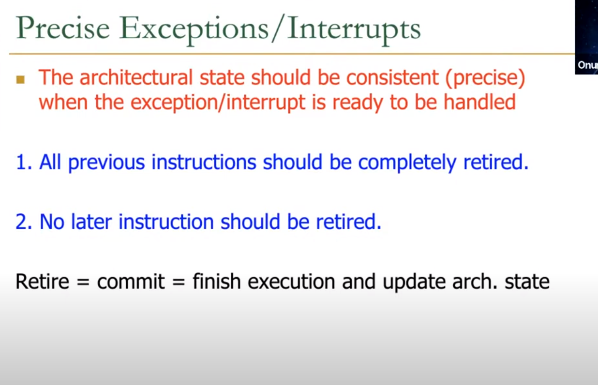
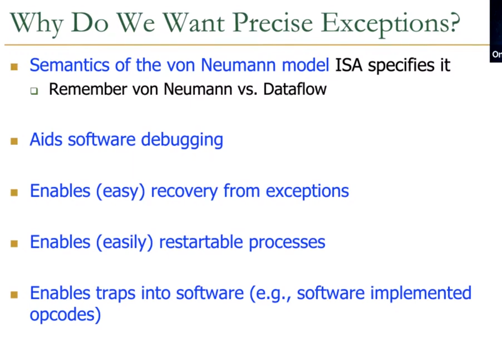
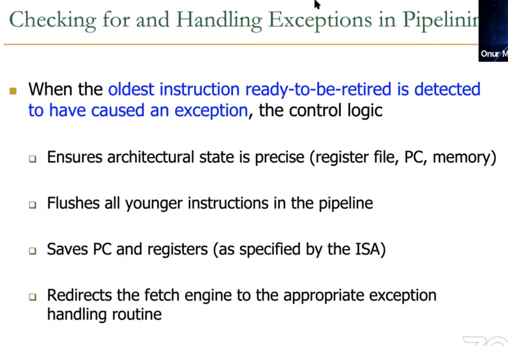
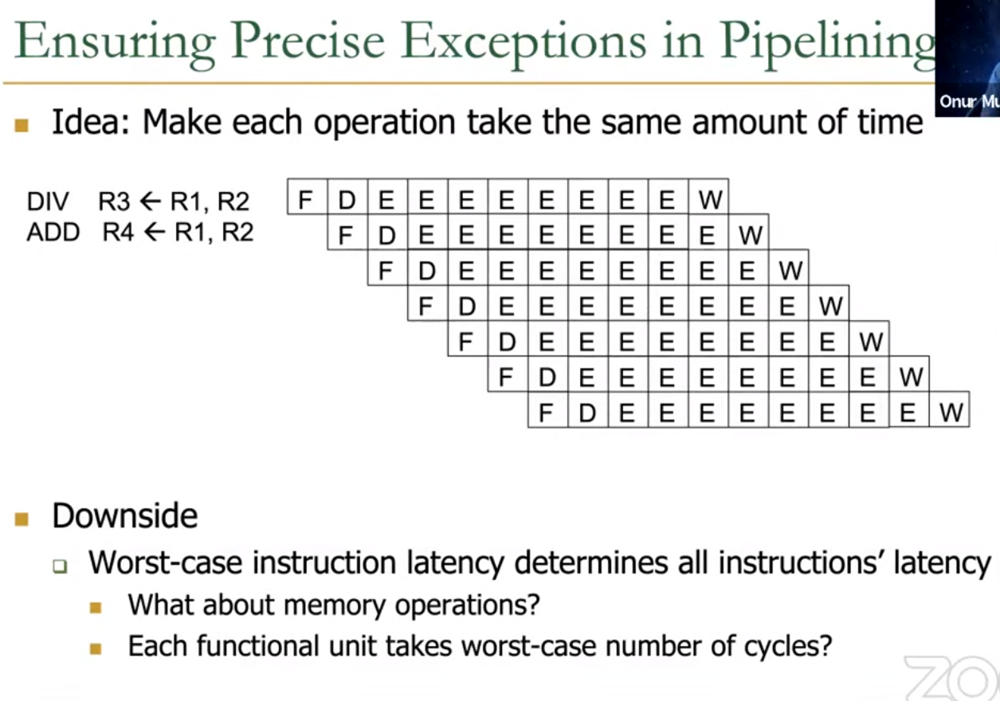
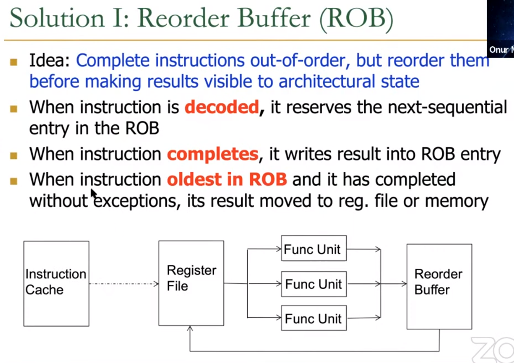
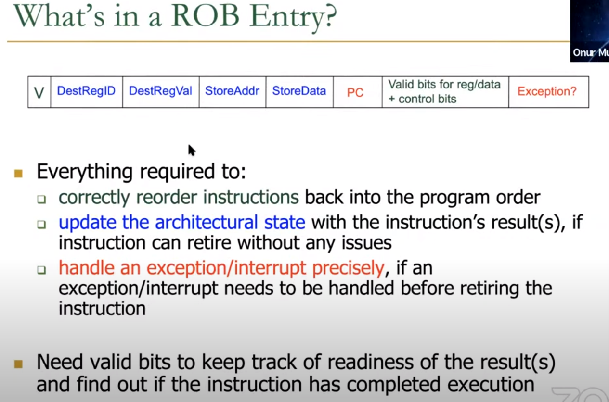
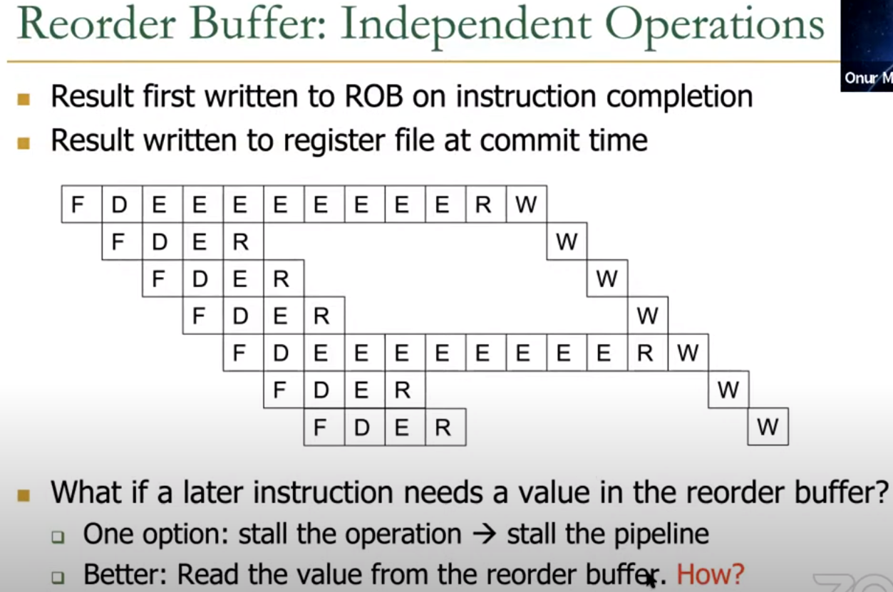

## Von Neumann Model & Sequential Semantic

### Sequential Semantic, Predictability
> The sequential semantic of Von Neumann model are necessary to keep programmer sane.

#### Sequential Semantics in Programming

Sequential semantics are fundamental for allowing programmers to understand, reason about, and debug their programs effectively. Let's delve into why this is the case.

#### What are Sequential Semantics?

Sequential semantics refer to the model of computation where instructions are executed one after another in a strict sequence, as written by the programmer. This is the mental model most programmers use when writing and understanding code.

#### Benefits of Sequential Semantics

#### 1. Ease of Reasoning
- **<span style="color:green">Predictability**: When a program follows sequential semantics, the effects of each instruction are predictable based on the state of the system right before that instruction. This makes it easier to reason about what the program will do at each step.
- **Causality**: Each instruction clearly follows from the previous one, establishing a straightforward cause-and-effect relationship. This causality is crucial for understanding how changes in code will affect the program’s behavior.

#### 2. Simplified Debugging
- **Breakpoints and Stepping**: Debuggers often use breakpoints and step-through execution, which rely on the sequential execution model. With sequential semantics, setting a breakpoint at a specific line of code ensures that the program will halt right at that point, allowing for precise inspection of the program state.
- **Traceability**: When an error occurs, developers can trace back through the sequence of executed instructions to find the root cause. This traceability is much harder to achieve if instructions were executed out-of-order or speculatively.

#### 3. Consistency
- **<span style="color:green">State Consistency**: Sequential semantics ensure that the state of the system (registers, memory, etc.) is consistent with the order of instructions. This consistency simplifies the mental model needed to understand the program’s behavior.
- **Exception Handling**: If an exception occurs, it is clear which instructions have been executed and what the state of the system should be, making it easier to handle exceptions correctly.

### Multi-Cycle Execution


We will talk about an issue in pipeline that we havn't covered before.

First we have to understand what is multi-cycle execution in pipeline. Notice that the amount of time of execution varies significantly among different instructions. 

For examples:
1. Integer Add might takes 1 cycle.
2. Float Division might takes 60 cycles.
3. Memory Access might takes hundres of cycles.

> Note that the clock cycle is tend to be fixed in multi-cycle or pipelined microarchitecture, and we try to divide each phase into multiple stages according to the time it takes.

- How can we design the pipeline so that each instruction can be executed without disturbing each other, in consideration of such a difference of time?

One solution is let all instructions takes the same number of cycles in execution. Though we can still maintain high throughput with pipelined design, we will meet lot of issues, like <b>data dependency issues become problematic in deep pipeline.</b>

Hence people come up with the idea of Multi-Cycle Execution, where <u> specialized functional units that takes different number of cycles are added into the pipeline.</u>

> We still have the in-order execution, since we send the operands to functional unit in order.

<b> However we can let independent instructions start execution on a different funtional unit while previous long-lantency instruction finishes, as oppose to waiting it until completion. This way, independent instructions execute concurrently in different functional units.</b>

But different instructions still needs to finish in-order. Why?

1. **Simplified Debugging**:
   - **Predictable Behavior**: Programmers expect the instructions to execute in the order they are written. This predictability simplifies the process of debugging.
   - **Clear Causality**: Knowing that instruction outcomes are committed in order helps in tracing the cause and effect in the program flow.

2. **Consistency in Program State**:
   - **Avoiding Race Conditions**: In-order completion prevents race conditions that can arise if later instructions are allowed to commit their results before earlier ones.
   - **Correct Data Flow**: Ensures that data dependencies are respected, and the correct data is available at each step of execution.

3. **Precise Exceptions and Interrupts**:
   - **Accurate State**: By completing instructions in order, the processor can provide an accurate architectural state at the point of an exception or interrupt.
   - **Correct Recovery**: It simplifies the recovery and handling of exceptions, as the state reflects a consistent and valid program state up to the point of interruption.

### Example
Consider the following sequence of instructions:
```
1. MUL R1, R2, R3  // Instruction 1
2. DIV R4, R5, R6  // Instruction 2
3. ADD R7, R8, R9  // Instruction 3
```
In an out-of-order processor:
- The `ADD` instruction might complete before the `MUL` and `DIV` due to its operands being ready and the availability of the multiplier unit.
- However, the processor ensures that `ADD` writes its result to `R7` only after the `MUL` and `DIV` have written their results to `R1` and `R4`, respectively.

This way, the architectural state reflects the correct sequential execution, making the program easier to understand and debug.

### Issues in Multi-Cycle Execution



--- 
#### Further Explanation with Example in Image

- A consistent architectural state refers to a state of a computing system where the contents of all architectural registers, memory locations, and other observable processor states <b>correctly reflect the outcomes of all executed instructions in the exact order specified by the program.</b> This concept is crucial for ensuring <b>predictable and reliable program execution, debugging, and exception handling.</b>

- Let's look at the picture, what if in div instruction the divisor is 0? We know that the result of R4 will be undefined and that's something we really need to avoid. Such misbehavior during instruction execution is called an exception. When encountering an exception, we should stop execution immediately. However, shown in the picture, if we commit those instructions out-of-order, then subsequent instructions have already committed their results, the architectural state becomes inconsistent.

- <b>We should have a precise architectural state at the boundary of handling the exception.</b>

- Let me say something further about debug. When the exception is raised, then I know which instrcution causes the exception. Since all previous be completely retired, I can debug and check whether the instruction correctly alters the architectural state.

### Exceptions and Interrupts


### Precise Exception


- The architectural state should be precise when the exception <b>is ready to be handled.</b>

### Why Precise Exception?


- ISA specified.
- After we come back from exception handler routine which fixes the condition that causes exception, we can restart the following instructions easily.
- All in all, precise exception and sequential semantic makes everything easier.

### Exception Checking & Handling


- <b style="color:green">Ensures architectural state is precise.</b>
- Kill all the later instruction since stream of execution is altered.

### Precise Exception in Deep Pipelining


- If we make each instruction takes equal time, then the worst-case instruction latency will determines all instruction's latency. However, memory operations may takes hundreds of cycles to execute, which will make our pipeline extremely deep.
- The maximum number of pipeline stages is limited by pipeline hazards, sequencing overhead, and cost.<b style="color:green"> Longer pipelines introduce more dependencies</b>. Some of the dependencies can be solved by forwarding but others require stalls, which increase the CPI. The pipeline registers between each stage have sequencing overhead from their setup time and clk-to-Q delay (as well as clock skew). Due to this sequencing overhead, adding more pipeline stages gives diminishing returns. Finally, adding more stages increases the cost because of the extra pipeline registers and hardware required to handle hazards.(make pipeline complex and difficult.)
- Hence this design will significantly decrease the throughput of our pipeline due to numerous<b style="color:green"> dependency issues.</b>

### Solution: Reorder Buffer - <span style="color:cyan">Maintain Sequential Semantic</span>


Great Idea: We can complete instruction execution out-of-order but report their results to programmer in-order to maintain the squential semantic.

- ROB as a circular queue: the oldest instruction is at the head, while the latest instruction is at the tail. 
- New instruction will enqueue, and the latest instruction will dequeue.
- When instruction completes, it writes result into ROB entry. We will say the ROB entry in the next section.
- When instruction safely retires(all work done without exceptions), update architectural state and remove the head entry in ROB.
- ROB buffers all the information of instructions that are decoded but not retired.

### ROB Entry


- V specify whether this entry is allocated.
- Blue part and valid bits are necessary for update architecture state.
- Red part are everything needed for exception handling.
- Head and tail pointer maintains the circular queue structure of ROB.
- Valid bits for tracking the <b style="color:green">readiness</b> of the result, specify whether the execution of this instruction is over. (used for data dependency resolve, since the entry in ROB can provide data for later instruction!)

### ROB - How to Support data Dependency Resolve & Maintain Sequential Semantic


- Result first written to ROB on instruction completion, then write to register file at commit time. (Hence a R stage is added into the pipeline for writing result into ROB)

- Later instruction can read value from
    - ROB.
    - Architectural registers.
    - Pipeline.